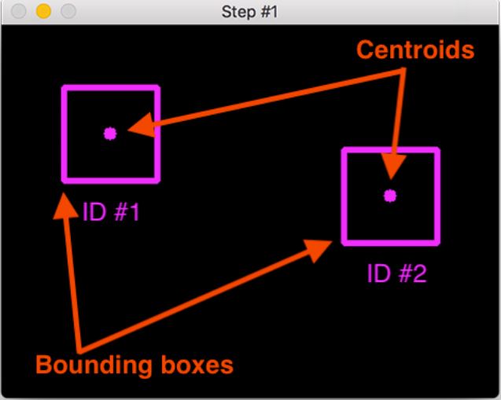
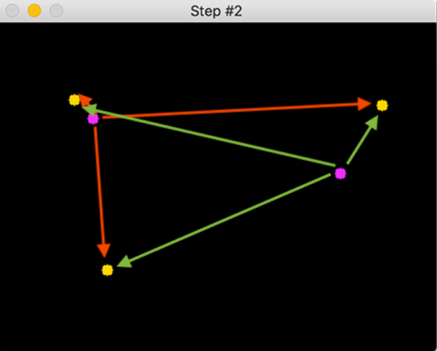
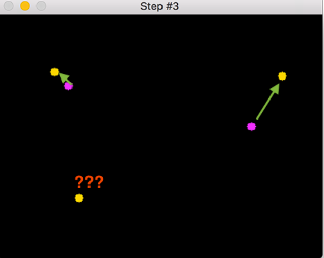

# Simple-Object-Tracking-with-OpenCV

Object tracking là quá trình bao gồm:
* Lấy các object detections (ví dụ tọa độ của bộ bounding boxes)
* Tạo ID duy nhất cho mỗi detection
* Tracking theo các vật thể khi nó di chuyển, duy trì ID đó

Object tracking áp dụng ID duy nhất giúp chúng ta có thể đếm vật thể trong video.

Thuật toán object tracking lý tưởng có các ýếu tố sau:
* Chỉ cần thực hiện object detection một lần
* Có thể xử lý được các vật thể được theo dõi "biến mất" hoặc di chuyển ra ngoài giới hạn video frame
* Vẫn có thể theo dõi được các đối tượng "biến mất" giữa các khung hình
* Xử lý được occlusion (các vật thể gần nhau dường như gộp thành một)

Trong bài này chúng ta sẽ thực hiện simple object tracking algorithm - `centroid tracking`. Algorithm này dựa trên Euclidean distance giữa:
- Existing object centroids (các tâm vật thể đã có - đã được theo dõi)
- New object centroids (các tâm vật thể mới trong các khung hình tiếp theo)

# Centroid tracking algorithm
Centroid tracking algorithm là quá trình nhiều bước (multi-step). 
* **Bước 1:** Accept bounding box coordinates and compute centroids

Lấy tọa độ của bounding boxes từ object detector sau đó sử dụng chúng để xác định centroids. Object detector có thể là HOG + Linear SVM, SSDs, Faster R-CNN... Do đây là các bounding box được tạo đầu tiên nên ta sẽ gán cho chúng ID duy nhất.

* **Bước 2:** Xác định Euclidean distance between new bounding boxes and existing objects

Cho các frame tiếp theo trong video chúng ta thực hiện lại **Bước 1** để xác định centroids (*Việc này quan trong có nghĩa rằng trong mỗi frame chúng ta đều thực hiện object detection*). Tuy nhiên thay vì gán ID duy nhất mới cho các vật thể phát hiện được (không còn là object tracking) chúng ta cần xác định nếu có sự liên quan giữa `new object centroid` và `old object centroid` không. Để thực hiện điều này chúng ta đi tính Euclidean distance giữa các cặp existing object centroids và input object centroids (không xác định khoảng cách giữa các existing object centroids hay giữa các input object centroids - việc này không có ý nghĩa)

* **Bước 3:** Update (x, y) cooordinates of existing objects

Giả sử chính của centroid tracking algorithm là vật thể có thể di chuyển giữa các frames nhưng khoảng các centroids trong các frame `F_t và F_t+1` sẽ nhỏ hơn tất cả khoảng cách khác giữa objects trong 2 frames đó.
Do đó nếu chúng ta liên kết các centroids với khoảng cách nhỏ nhất giữa các frames liên tiếp chúng ta có thể thực hiện được object tracking.

Chúng ta đã liên kết được 2 objects, còn object mới thì sao?

* **Bước 4:** Register new objects

Bước này đơn giản chỉ thêm new object vào danh sách cách vật thể bị theo dõi.
- Gán ID cho vật thể mới
- Lưu centroid của bounding box cho vật thể đó

Sau đó có thể quay lại **bước 2** để lặp lại đối với các frames trong video.

 * **Bước 5:** Deregister old objects

 Các algorithm phải có khả năng xử lý các vật thể "biến mất" khỏi khung hình. Việc xử lý cụ thể như thế nào sẽ tùy thuộc vào từng trường hợp cụ thể. Ở đây nếu vật thể không được nối với bất kì vật thể nào trong `N` khung hình liên tiếp (rời khỏi khung hình và biến mất) thì bị loại khỏi danh sách theo dõi cho đơn giản.

 Một số bước chung để thực hiện theo dõi đối tượng:
 * Khởi động webcam
 * Load face detector
 * Khởi tạo CentroidTracker và sử dụng nó để tarck đối tượng
 * Hiển thị kết quả

# **Giới hạn của phương pháp**
- Cần thực hiện object detection trong các khung hình liên tục gây tốn tài nguyên tính toán
- Yêu cầu các centroid của các objects phải gần nhau trong các khung hình liên tiếp
- Có thể có sự hoán đổi ID nếu các object quá gần nhau
 